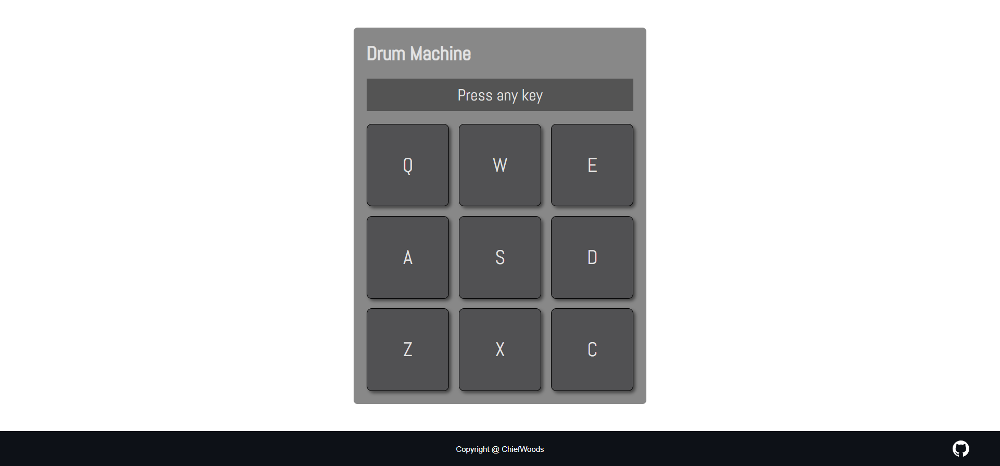

# Drum Machine



Web instrument for Front End Development Libraries in [freeCodeCamp](https://www.freecodecamp.org/learn/).

[Live Website](https://chiefwoods.github.io/drum-machine/)

[Source Repository](https://github.com/ChiefWoods/drum-machine)

## Features

- Play pre-recorded audio snippets
- Includes keyboard support

## Built With

### Languages

- [](https://svelte.dev/)

### Bundlers

- [](https://vitejs.dev/)

## Getting Started

### Prerequisites

Update your Bun toolkit to the latest version.

```bash
bun upgrade
```

### Setup

1. Clone the repository

```bash
git clone https://github.com/ChiefWoods/formula-calculator.git
```

2. Install all dependencies

```bash
bun install
```

3. Start development server

```bash
bun run dev
```

4. Build project

```bash
bun run build
```

5. Preview build

```bash
bun run preview
```

## Issues

View the [open issues](https://github.com/ChiefWoods/drum-machine/issues) for a full list of proposed features and known bugs.

## Acknowledgements

### Resources

- [Shields.io](https://shields.io/)
- [Google Fonts](https://fonts.google.com/)
- [Pictogrammers](https://pictogrammers.com/)
- [Font Awesome](https://fontawesome.com/icons)

### Hosting

- [GitHub Pages](https://pages.github.com/)

## Contact

[chii.yuen@hotmail.com](mailto:chii.yuen@hotmail.com)